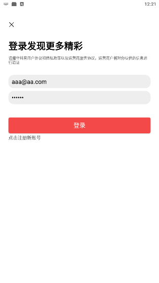
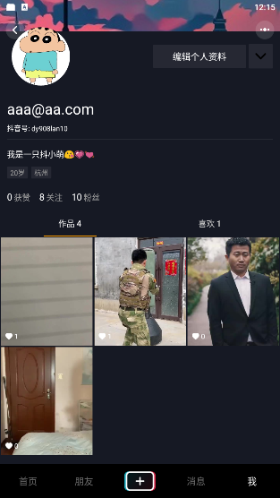
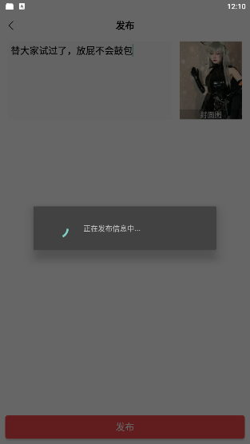
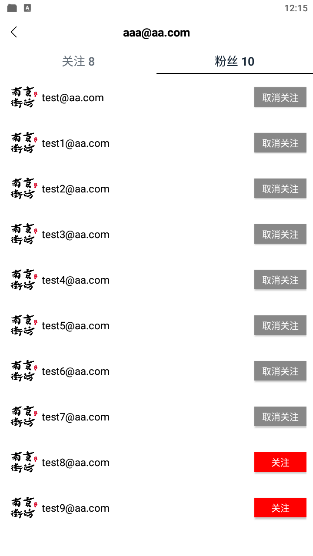
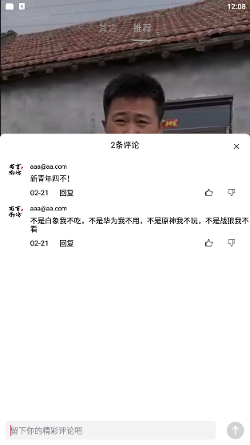
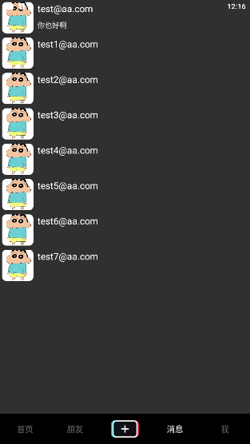
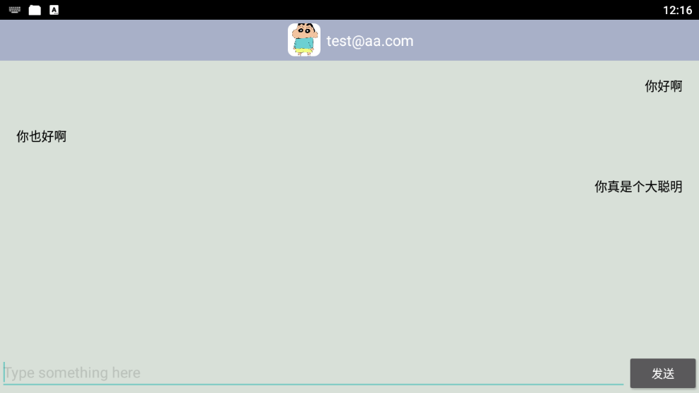
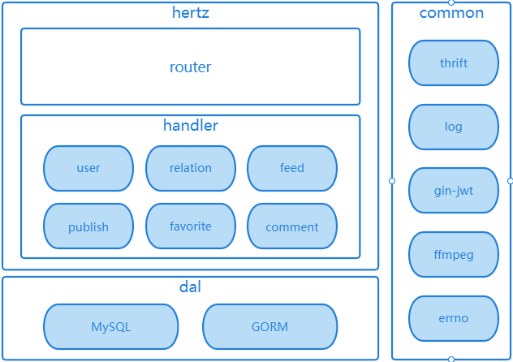
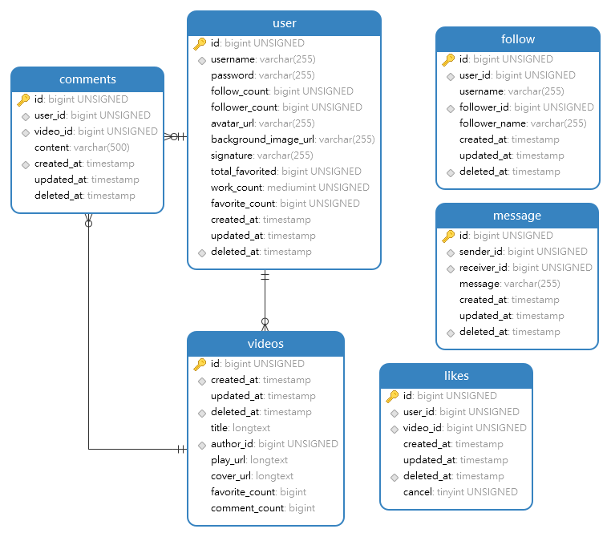

<p align="center">
    <a href="https://github.com/hts0000/simple-tiktok">
        
    </a>
</p>

# 项目简介
本项目名为`simple-tiktok`，是第五届字节跳动后端青训营大项目——极简版抖音。

## 功能模块介绍
<table>
	<tr>
	    <td ></td>
	    <td colspan="2"><b>互动方向</b></td>
	    <td colspan="2"><b>社交方向</b></td>
	</tr >
	<tr >
	    <td>基础功能项</td>
	    <td rowspan="1" colspan="4">视频 Feed 流、视频投稿、个人主页</td>
	</tr>
	<tr>
	    <td>基础功能项说明</td>
        <td rowspan="1" colspan="4">
            <p>
            视频Feed流：支持所有用户刷抖音，视频按投稿时间倒序推出
            </p>
            <p>
            视频投稿：支持登录用户自己拍视频投稿
            </p>
            <p>
            个人主页：支持查看用户基本信息和投稿列表，注册用户流程简化
            </p>
        </td>
	</tr>
	<tr>
	    <td>方向功能项</td>
        <td>喜欢列表</td>
        <td>用户评论</td>
        <td>关系列表</td>
        <td>消息</td>
	</tr>
	<tr>
        <td rowspan="3">方向功能项说明</td>
	    <td>登录用户可以对视频点赞，在个人主页喜欢Tab下能够查看点赞视频列表</td>
        <td>支持未登录用户查看视频下的评论列表，登录用户能够发表评论</td>
        <td>登录用户可以关注其他用户，能够在个人主页查看本人的关注数和粉丝数，查看关注列表和粉丝列表</td>
        <td>登录用户在消息页展示已关注的用户列表，点击用户头像进入聊天页后可以发送消息</td>
	</tr>
</table>

## 项目展示
<a href="https://github.com/hts0000/simple-tiktok">
    
    
    
    
</a>

<a href="https://github.com/hts0000/simple-tiktok">
    
    
    
    
</a>

## Quick Start
安装极简版抖音app，安装包：`pkg/pkg/app-release.apk`

启动基础依赖
```shell
# 安装ffmpeg
apt-get install ffmpeg

# 自行安装 docker 及 docker-compose
docker-compose up -d 
```

启动本项目
```shell
go run .
```

## 项目实现介绍
使用开源Http框架[Hertz](https://github.com/cloudwego/hertz/blob/develop/README_cn.md) + [Thrift](https://thrift.apache.org/docs/idl) + [GORM](https://gorm.io/zh_CN/docs/index.html) 完成本项目的开发。功能实现完整，代码结构清晰，为`MVC`三层架构。项目遵循`Hertz`框架开发规范和流程，代码简单易懂。
### 项目架构


### 数据库设计


### 项目结构
```shell
.
├── biz
│   ├── dal         # dal层，数据库操作逻辑
│   ├── handler     # handel层，实现接口逻辑
│   ├── model       # hertz根据idl文件生成的代码
│   ├── mw          # 各个路由的中间件封装
│   └── router      # router层，处理各个接口路由
├── docker-compose.yaml     # 依赖环境
├── Dockerfile      # simple-tiktok dockerfile脚本
├── file            # 视频投稿存储目录
│   └── upload
├── gen.sh          # 代码生成脚本
├── go.mod
├── go.sum
├── idl             # idl文件目录，定义各个接口
│   └── simple_tiktok.thrift
├── main.go
├── pkg             # 公共模块
│   ├── config
│   ├── configs
│   ├── consts
│   ├── errno
│   └── pkg         # 极简版抖音apk，simple-tiktok二进制文件
├── README.md
├── router_gen.go
├── router.go
```


## 未来展望
1. 使用`kitex RPC` + `etcd`实现微服务架构
2. 使用`redis`优化项目性能
3. 使用`rabbitmq`实现削峰
4. 使用云厂商`oss`对象存储
5. 使用`prometheus`做监控，写一个`exporter`
6. 用户聊天模块发送消息敏感信息拦截过滤
7. 结合`docker`实现独立测试环境
8. 视频模块结合推荐算法
9. 项目打包成`docker`镜像

## 版权说明
该项目签署了MIT 授权许可，详情请参阅 LICENSE.txt

## 鸣谢
字节跳动后端青训营
